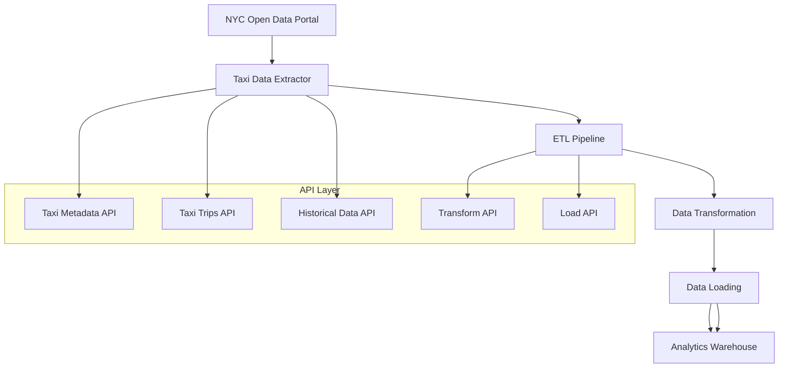

# NYC TLC Data Flow

## NYC TLC API Endpoints

### Metadata
- `GET /api/v1/taxi/metadata` - Get dataset metadata

### Data Access
- `GET /api/v1/taxi/trips` - Get taxi trip data
- `GET /api/v1/taxi/historical` - Get historical taxi data

### Processing
- `POST /api/v1/taxi/transform` - Transform raw taxi data
- `POST /api/v1/taxi/load` - Load transformed data to warehouse